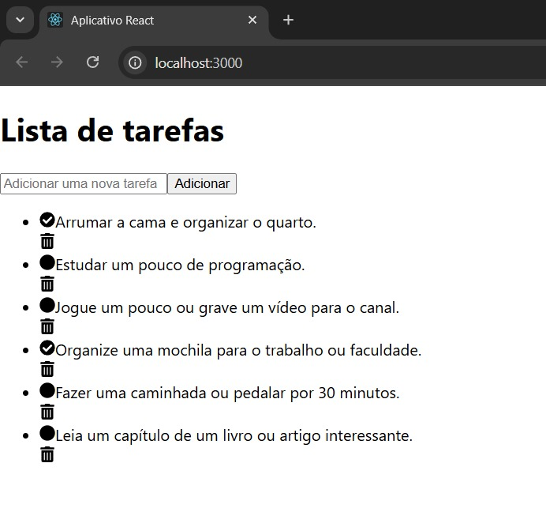

# Todo List React

## Descrição

Este é um projeto de **Lista de Tarefas (Todo List)** criado com **React** em **2024**. O objetivo é fornecer uma interface interativa e visualmente agradável para adicionar, marcar e remover tarefas. O aplicativo tem um design simples e intuitivo, com um fundo escuro, botões interativos e ícones modernos, tornando a experiência do usuário mais fluída e agradável.

Embora eu tenha feito este projeto em 2024, acabei esquecendo de anexá-lo ao meu portfólio no GitHub. Agora estou atualizando meu repositório e anexando todos os meus projetos, incluindo este.

### Funcionalidades:

- Adicionar tarefas
- Marcar tarefas como concluídas
- Remover tarefas
- Interface interativa e responsiva
- Suporte para modo escuro

## Demonstração

## Tecnologias Utilizadas

- **React**: Biblioteca JavaScript para construir interfaces de usuário.
- **React Icons**: Conjunto de ícones para tornar a interface mais interativa.
- **CSS3**: Estilização do layout.
- **React Context** (opcional se usar para gerenciamento de estado global)
- **React Hooks** (useState, useEffect)

## Como Rodar o Projeto Localmente

Para rodar o projeto localmente em sua máquina, siga os passos abaixo:

# Clone o repositório para o seu computador
git clone https://github.com/jhonatanthiago/todo-list-react.git

# Acesse o diretório do projeto
cd todo-list-react

# Instale as dependências
npm install

# Inicie o servidor de desenvolvimento
npm start
